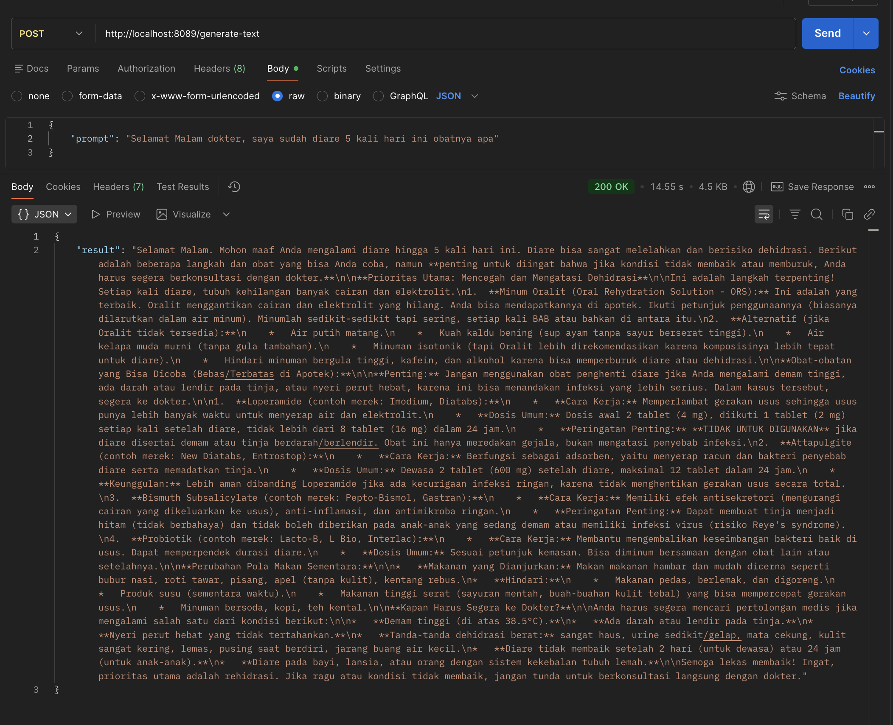

# Gemini Flash API Project

## Introduction

This project is a Node.js Express server designed to interact with the Google Gemini AI. It provides a set of API endpoints for generating content from text, images, documents, and audio.

This documentation outlines the project structure, application flow, and how to use the API.

## Project Structure

The project has been refactored to follow a more organized and scalable structure, separating concerns into different directories.

```
gemini-flash-api/
├── src/
│   ├── config/
│   │   └── index.js      # Configuration (API keys, ports)
│   ├── controllers/
│   │   └── generateController.js  # Request/response logic
│   ├── routes/
│   │   └── generate.js     # API route definitions
│   ├── services/
│   │   └── geminiService.js # Gemini AI interaction logic
│   └── app.js            # Main Express application setup
├── .env                  # Environment variables (API key)
├── index.js              # Application entry point
├── package.json
└── README.md             # This documentation
```

### Directory Roles

*   **`src/`**: Contains all the application's source code.
*   **`src/config/`**: Manages configuration. `index.js` loads environment variables from the `.env` file, such as the Gemini API key and server port.
*   **`src/services/`**: Holds the core business logic. `geminiService.js` encapsulates all the functions that directly interact with the Google Gemini API.
*   **`src/controllers/`**: Acts as the bridge between the routes and the services. `generateController.js` contains the functions that handle incoming HTTP requests, call the appropriate service, and then formulate and send the HTTP response.
*   **`src/routes/`**: Defines the API's endpoints. `generate.js` maps the URL paths (e.g., `/generate-text`) to the corresponding controller functions.
*   **`src/app.js`**: The heart of the application. It initializes the Express server, sets up middleware (like `express.json()`), and connects the defined routes.
*   **`index.js`**: The main entry point for starting the application. It simply imports and runs `src/app.js`.

## Application Flow

Here’s how a typical request is handled, using `POST /generate-text` as an example:

1.  **Entry Point (`index.js`)**: The `node index.js` command starts the application. This file imports `src/app.js`.
2.  **App Setup (`src/app.js`)**: The Express server is initialized. It's configured to use the routes defined in `src/routes/generate.js`. The server starts listening for requests on the specified port.
3.  **Route Matching (`src/routes/generate.js`)**: A `POST` request arrives at `/generate-text`. The router in `generate.js` sees this and calls the `generateText` function from the controller.
4.  **Controller Logic (`src/controllers/generateController.js`)**: The `generateText` function in the controller is executed. It extracts the `prompt` from the request body. It then calls the `generateTextService` function from the service layer, passing the prompt to it.
5.  **Service Logic (`src/services/geminiService.js`)**: The `generateTextService` function in the service communicates with the Google Gemini API, sending the prompt and waiting for a response.
6.  **Response Handling**: The controller receives the result from the service. It then sends a JSON response back to the client with a `200 OK` status and the generated text, or a `500 Internal Server Error` if something went wrong.

## Installation and Usage

1.  **Install Dependencies**: If you haven't already, open your terminal in the project root and run:
    ```bash
    npm install
    ```
2.  **Set Up Environment Variables**: Make sure you have a `.env` file in the root directory with your Gemini API key:
    ```
    GEMINI_API_KEY=your_api_key_here
    ```
3.  **Run the Server**:
    ```bash
    node index.js
    ```
    The server will start, and you'll see a message like: `Server ready on http://localhost:8089`.

## API Endpoints

*   **Generate Text**
    *   **Method**: `POST`
    *   **Endpoint**: `/generate-text`
    *   **Body**: `{ "prompt": "Your text prompt" }`

*   **Generate from Image**
    *   **Method**: `POST`
    *   **Endpoint**: `/generate-from-image`
    *   **Form-Data**:
        *   `prompt` (text): Your text prompt.
        *   `image` (file): The image file.

*   **Generate from Document**
    *   **Method**: `POST`
    *   **Endpoint**: `/generate-from-document`
    *   **Form-Data**:
        *   `prompt` (text, optional): Your text prompt.
        *   `document` (file): The document file.

*   **Generate from Audio**
    *   **Method**: `POST`
    *   **Endpoint**: `/generate-from-audio`
    *   **Form-Data**:
        *   `prompt` (text, optional): Your text prompt.
        *   `audio` (file): The audio file.

